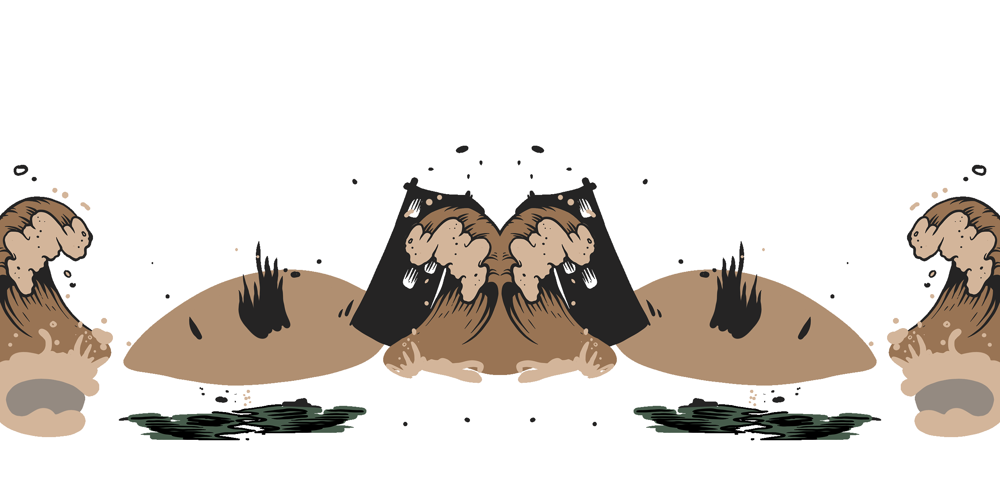

# 💰 Get $OiOi Rewards


**Note**: This tutorial is not only for [**The ROTY BROI NFTs**](https://docs.endhonesa.com/02-the-creations.../waivfves-1/41.-the-roty-broi), [**ROTY BASE dETH NFTs**](https://docs.endhonesa.com/02-the-creations.../waivfves-1/16.-roty-base-deth), [**The Melting Land NFTs**](https://docs.endhonesa.com/02-the-creations.../waivfves-2/15.-the-melting-land), and [**Amanda Wives NFTs**](https://docs.endhonesa.com/02-the-creations.../waivfves-2/14.-amanda-wives) holders that want to stake their **NFT**.


## The NFTs and The FTs...

***

### There are NFTs Before The $OiOi FTs...

***

#### [The ROTY BROI NFTs](https://docs.endhonesa.com/02-the-creations.../waivfves-1/41.-the-roty-broi)

[**The ROTY BROI**](https://docs.endhonesa.com/02-the-creations.../waivfves-1/41.-the-roty-broi) is a collection of 1047 unique generative and handpicked **NFTs**, that live on the **Polygon** blockchain. One of the benefits for [**The ROTY BROI's holders**](https://docs.endhonesa.com/02-the-creations.../waivfves-1/41.-the-roty-broi) is able to stake their **NFT** to get a utility token reward, that is [**The Polygon $OiOi Fungible Tokens**](https://docs.endhonesa.com/02-the-creations.../waivfves-1/polygon-usdoioi-fts).

> Get [**The ROTY BROI NFTs**](https://docs.endhonesa.com/02-the-creations.../waivfves-1/41.-the-roty-broi), stake it and claim your reward on [**The ROTY BROI staking contract**](staking-the-roty-broi.md).
>
> — Source #1: [**The ROTY BROI NFTs collection**](https://docs.endhonesa.com/02-the-creations.../waivfves-1/41.-the-roty-broi)
>
> — Source #2: [**Prof. NOTA's Discord**](https://discord.gg/5KrsT6MbFm)

***

#### [**ROTY BASE dETH NFTs**](https://docs.endhonesa.com/02-the-creations.../waivfves-1/16.-roty-base-deth)

[**ROTY BASE dETH NFTs**](https://docs.endhonesa.com/02-the-creations.../waivfves-1/16.-roty-base-deth) is a collection of those who did not survive [**The Melting Land**](https://docs.endhonesa.com/02-the-creations.../waivfves-2/15.-the-melting-land), that live on the **BASE** blockchain. One of the benefits for the holders is able to stake their **NFT** to get a utility token reward, that is [**The Ethereum $OiOi Fungible Tokens**](https://docs.endhonesa.com/02-the-creations.../waivfves-1/ethereum-usdoioi-fts).

> Go get it, love it, hold it, and miss them all!
>
> — Source #1: [**ROTY BASE dETH NFTs**](https://docs.endhonesa.com/02-the-creations.../waivfves-1/16.-roty-base-deth)
>
> — Source #2: [**Prof. NOTA's Discord**](https://discord.gg/5KrsT6MbFm)

***

#### [The Melting Land NFTs](https://docs.endhonesa.com/02-the-creations.../waivfves-2/15.-the-melting-land)

[**The Melting Land NFTs**](https://docs.endhonesa.com/02-the-creations.../waivfves-2/15.-the-melting-land) are a collection on the **BASE** blockchain. One of the benefits for the holders is able to stake their **NFT** to get a utility token reward, that is [**The Ethereum $OiOi Fungible Tokens**](https://docs.endhonesa.com/02-the-creations.../waivfves-1/ethereum-usdoioi-fts).

> — Source #1: [**The Melting Land NFTs**](https://docs.endhonesa.com/02-the-creations.../waivfves-2/15.-the-melting-land)
>
> — Source #2: [**Prof. NOTA's Discord**](https://discord.gg/5KrsT6MbFm)

<figure><figcaption>
The Melting Land
</figcaption></figure>

***

#### [Amanda Wives NFTs](https://docs.endhonesa.com/02-the-creations.../waivfves-2/14.-amanda-wives)

[**Amanda Wives NFTs**](https://docs.endhonesa.com/02-the-creations.../waivfves-2/14.-amanda-wives) are a collection on the **BASE** blockchain. One of the benefits for the holders is able to stake their **NFT** to get a utility token reward, that is [**The Ethereum $OiOi Fungible Tokens**](https://docs.endhonesa.com/02-the-creations.../waivfves-1/ethereum-usdoioi-fts).

> — Source #1: [**Amanda Wives NFTs**](https://docs.endhonesa.com/02-the-creations.../waivfves-2/14.-amanda-wives)
>
> — Source #2: [**Prof. NOTA's Discord**](https://discord.gg/5KrsT6MbFm)

***

### There is The $OiOi FTs After The NFTs...

***

#### [The Polygon $OiOi FTs](https://docs.endhonesa.com/02-the-creations.../waivfves-1/polygon-usdoioi-fts)

[**The Polygon $OiOi FTs**](https://docs.endhonesa.com/02-the-creations.../waivfves-1/polygon-usdoioi-fts) are utility tokens to use within the **OiOi Community** in [**Prof. NOTA's Discord**](https://discord.gg/5KrsT6MbFm). There are only [**47,474,747 $OiOi**](https://docs.endhonesa.com/02-the-creations.../waivfves-1/polygon-usdoioi-fts) supplies on the **Polygon** blockchain and the [**$OiOi FTs**](https://docs.endhonesa.com/02-the-creations.../waivfves-1/polygon-usdoioi-fts) value is **1 $OiOi \~ 747 $MATIC \~ 0.0474 $BTC** in [**Prof. NOTA's Discord**](https://discord.gg/5KrsT6MbFm).

> — Source: [**The ROTY BROI NFTs staking**](staking-the-roty-broi.md)


**Warning**: There is a terrible news! A known vulnerability impacted the smart contract of [**Polygon $OiOi FTs**](https://docs.endhonesa.com/02-the-creations.../waivfves-1/polygon-usdoioi-fts) and to mitigate it, [**Prof. NOTA**](https://nota.endhonesa.com/) migrated [**Polygon $OiOi FTs**](https://docs.endhonesa.com/02-the-creations.../waivfves-1/polygon-usdoioi-fts) to the new smart contract without that known vulnerability.

Please follow all instructions on [**The ROTY BROI NFTs staking**](staking-the-roty-broi.md).

Please don't ignore this!!!!


***

#### [The Tezos $OiOi FTs](https://docs.endhonesa.com/02-the-creations.../waivfves-1/tezos-usdoioi-fts)

[**The Tezos $OiOi FTs**](https://docs.endhonesa.com/02-the-creations.../waivfves-1/tezos-usdoioi-fts) are utility tokens to use within the **OiOi Community** in [**Prof. NOTA's Discord**](https://discord.gg/5KrsT6MbFm). There are only [**47,474,747 $OiOi**](https://docs.endhonesa.com/02-the-creations.../waivfves-1/tezos-usdoioi-fts) supplies on the **Tezos** blockchain and the [**$OiOi FTs**](https://docs.endhonesa.com/02-the-creations.../waivfves-1/tezos-usdoioi-fts) value is **1 $OiOi \~ 747 $XTZ \~ 0.0474 $BTC** in [**Prof. NOTA's Discord**](https://discord.gg/5KrsT6MbFm).

> — Source: [**The Tezos $OiOi FTs**](https://docs.endhonesa.com/02-the-creations.../waivfves-1/tezos-usdoioi-fts)

***

#### [The Ethereum $OiOi FTs](https://docs.endhonesa.com/02-the-creations.../waivfves-1/ethereum-usdoioi-fts)

[**The Ethereum $OiOi FTs**](https://docs.endhonesa.com/02-the-creations.../waivfves-1/ethereum-usdoioi-fts) are utility tokens that have decided to be circulated on the **BASE** blockchain to use within the **OiOi Community** in [**Prof. NOTA's Discord**](https://discord.gg/5KrsT6MbFm). There are only [**47,474,747 $OiOi**](https://docs.endhonesa.com/02-the-creations.../waivfves-1/ethereum-usdoioi-fts) supplies on the **BASE** blockchain and the [**$OiOi FTs**](https://docs.endhonesa.com/02-the-creations.../waivfves-1/ethereum-usdoioi-fts) value is **1 $OiOi \~ 0.747 $ETH \~ 0.0474 $BTC** in [**Prof. NOTA's Discord**](https://discord.gg/5KrsT6MbFm).

> — Source: [**The Ethereum $OiOi FTs**](https://docs.endhonesa.com/02-the-creations.../waivfves-1/ethereum-usdoioi-fts)

***

P.S. Read this document freely for information and guidance. Do not redistribute or restate—no quotes, summaries, paraphrases, or derivatives—without prior written permission from [**Prof. NOTA**](https://nota.endhonesa.com/). Sharing the link is allowed. So, share the link, not the text. Do not discuss or re-tell the contents in any form—written, spoken, or recorded—without prior written permission.

***
